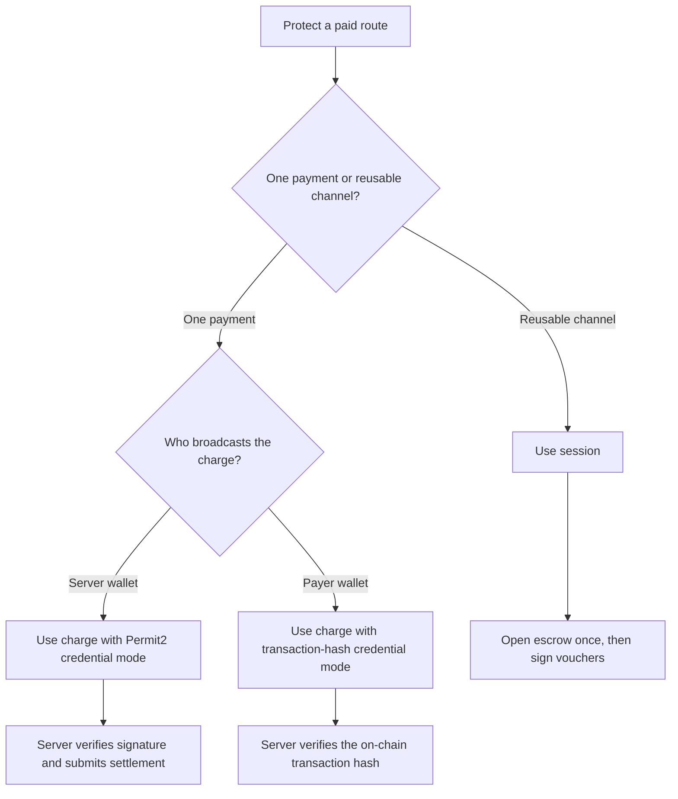
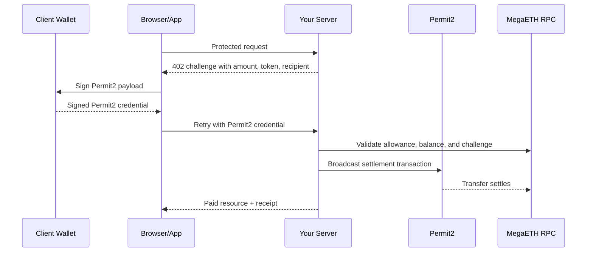
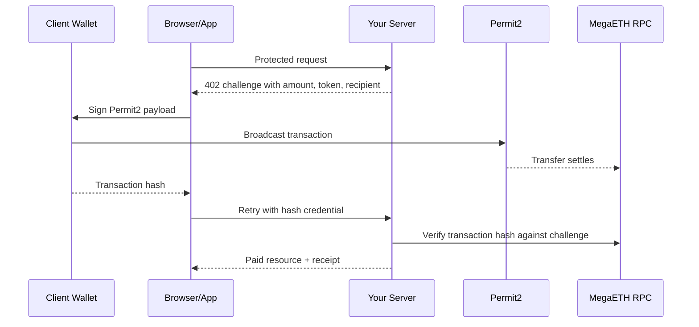
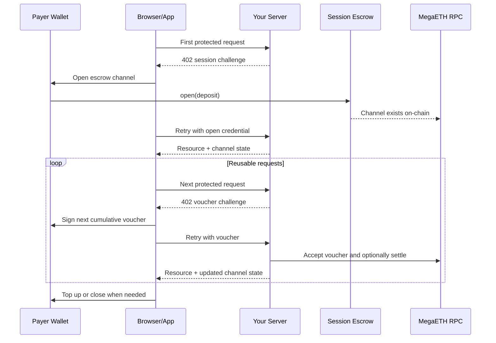

# Getting Started

This guide is the canonical onboarding path for the SDK.

The mental model is:

1. Configure explicit shared MegaETH settings once in `Mppx.create(...)`.
2. Register `megaeth.charge()` or `megaeth.session(...)`.
3. Issue request challenges from your route handler with only the request price.

## What You Are Building

Each flow has the same core actors:

- payer wallet: signs Permit2 payloads or session vouchers
- settlement wallet: broadcasts server-side transactions and receives funds
- RPC: reads chain state and waits for receipts
- token contract: holds balances and approvals
- Permit2 or escrow contract: enforces the payment method
- your server: issues challenges, verifies credentials, and serves the resource

## Choose Your Path

| If you need... | Choose | Why |
| --- | --- | --- |
| One payment per request | `charge` | Simple request-by-request settlement |
| Many requests against one funded channel | `session` | Lower repeat overhead after the first open |
| Server-sponsored charge gas | `charge` + Permit2 credential mode | The server broadcasts the settlement transaction |
| Client-broadcast payment | `charge` + transaction-hash credential mode | The payer broadcasts and the server verifies the hash |

## What Must Be Explicit

Always set these values explicitly:

- `chainId`: network selection decides the RPC, contract addresses, and validity of signatures and transactions
- `recipient`: payee selection decides who actually receives the funds

When the settlement wallet is also the payee, opt in visibly with `recipient: settlementAccount.address`.

`charge` still defaults these values when you omit them:

- `currency`: mainnet USDm
- `permit2Address`: canonical Permit2

## Flow Selection



## Prerequisites

- Node.js 20+
- pnpm 10+
- Foundry for contract build and test commands
- Anvil for deterministic integration runs
- a MegaETH-compatible RPC when you want to exercise live flows

## Install Dependencies

```bash
pnpm --dir typescript install
pnpm demo:install
```

## Core Commands

```bash
just contracts-test
just contracts-verify
just ts-typecheck
just ts-test
just ts-test-integration
just demo-test
just ts-audit
just release-prep
```

## Explicit Server Charge

This is the shortest explicit server setup for the mainnet/USDm path when the settlement wallet is intentionally also the payee:

```ts
import { Mppx, megaeth } from "mega-mpp-sdk/server";
import { megaethMainnet } from "mega-mpp-sdk/chains";
import { privateKeyToAccount } from "viem/accounts";

const settlementAccount = privateKeyToAccount(
  process.env.MEGAETH_SETTLEMENT_PRIVATE_KEY!,
);
const recipient = settlementAccount.address;

const mppx = Mppx.create({
  account: settlementAccount,
  chainId: megaethMainnet.id,
  methods: [megaeth.charge()],
  recipient,
  secretKey: process.env.MPP_SECRET_KEY!,
});
```

Then issue the request challenge from the route:

```ts
const result = await mppx.megaeth.charge({
  amount: "100000",
  description: "Premium API response",
})(request);

if (result.status === 402) {
  return result.challenge;
}

return result.withReceipt(new Response("ok"));
```

## Explicit Testnet Setup

Use explicit chain objects whenever you want a readable override:

```ts
import { Mppx, Store, megaeth } from "mega-mpp-sdk/server";
import { megaethTestnet } from "mega-mpp-sdk/chains";
import { privateKeyToAccount } from "viem/accounts";

const settlementAccount = privateKeyToAccount(
  process.env.MEGAETH_SETTLEMENT_PRIVATE_KEY!,
);
const recipient = settlementAccount.address;

const chargeMppx = Mppx.create({
  account: settlementAccount,
  chainId: megaethTestnet.id,
  currency: process.env.MEGAETH_PAYMENT_TOKEN_ADDRESS!,
  methods: [megaeth.charge({ submissionMode: "realtime" })],
  recipient,
  secretKey: process.env.MPP_SECRET_KEY!,
});

const sessionMppx = Mppx.create({
  account: settlementAccount,
  chainId: megaethTestnet.id,
  currency: process.env.MEGAETH_PAYMENT_TOKEN_ADDRESS!,
  methods: [
    megaeth.session({
      escrowContract: process.env.MEGAETH_SESSION_ESCROW_ADDRESS!,
      settlement: {
        close: { enabled: true },
        periodic: {
          intervalSeconds: 3600,
          minUnsettledAmount: "200000",
        },
      },
      store: Store.memory(),
      suggestedDeposit: "500000",
      unitType: "request",
      verifier: {
        allowDelegatedSigner: true,
        minVoucherDelta: "100000",
      },
    }),
  ],
  recipient,
  secretKey: process.env.MPP_SECRET_KEY!,
});
```

## Charge Options

### Credential Mode

| Mode | When to use it | Broadcasts the transaction |
| --- | --- | --- |
| `permit2` | Server should sponsor gas or own the final settlement path | Server |
| `hash` | Payer should broadcast directly and the server only verifies | Client |

### Submission Mode

| Mode | Good default? | Notes |
| --- | --- | --- |
| `realtime` | Best demo default | Shows MegaETH mini-block receipts when supported |
| `sync` | Advanced only | Requires `eth_sendRawTransactionSync` support |
| `sendAndWait` | Conservative fallback | Uses the standard send path plus receipt polling |

## Charge Process Flows

### Permit2 Credential Mode



### Transaction-Hash Credential Mode



## Session Process Flow



## Demo Quickstart

Choose one of these demo paths:

- local development: `pnpm demo:server` and `pnpm demo:app`
- Cloudflare compatibility: `pnpm demo:worker:build` and `pnpm demo:worker:dev`

For the MegaETH Carrot walkthrough, use two wallets:

- a server wallet with testnet ETH so it can pay gas for server-settled charge and session actions
- a client wallet with testnet ETH plus testnet USDC so it can approve Permit2 for charge and escrow for session

For the Carrot walkthrough, wire in the current testnet network, payment token,
explicit payee, and session escrow first:

```bash
export MEGAETH_CHAIN_ID=6343
export MEGAETH_RPC_URL=https://carrot.megaeth.com/rpc
export MEGAETH_PAYMENT_TOKEN_ADDRESS=0x75139a9559c9cd1ad69b7e239c216151d2c81e6f
export MEGAETH_RECIPIENT_ADDRESS=0xYOUR_SETTLEMENT_WALLET_ADDRESS
export MEGAETH_SESSION_ESCROW_ADDRESS=0xD83A68408539868e5f48D0E93537f56afBB9d512
```

That minimal setup is enough to boot the local demo on testnet and inspect the
configured charge and session routes:

```bash
pnpm demo:server
pnpm demo:app
```

Funded charge and session requests need a few more variables:

```bash
export PORT=3001
export DEMO_PUBLIC_ORIGIN=http://localhost:3001
export MPP_SECRET_KEY="$(openssl rand -hex 32)"
export MEGAETH_PERMIT2_ADDRESS=0x000000000022D473030F116dDEE9F6B43aC78BA3
export MEGAETH_SUBMISSION_MODE=realtime
export MEGAETH_SETTLEMENT_PRIVATE_KEY='YOUR_SERVER_PRIVATE_KEY'
export MEGAETH_FEE_PAYER=true
```

For the demo's server-broadcast Permit2 flow and session flow, keep
`MEGAETH_RECIPIENT_ADDRESS` equal to the settlement wallet address.

### Charge Demo Preparation

Approve Permit2 once from the client wallet before the first funded charge run:

```bash
export MEGAETH_RPC_URL=https://carrot.megaeth.com/rpc
export MEGAETH_PAYMENT_TOKEN_ADDRESS=0x75139a9559c9cd1ad69b7e239c216151d2c81e6f
export MEGAETH_PERMIT2_ADDRESS=0x000000000022D473030F116dDEE9F6B43aC78BA3
export CLIENT_PRIVATE_KEY='YOUR_CLIENT_PRIVATE_KEY'

cast send "$MEGAETH_PAYMENT_TOKEN_ADDRESS" \
  "approve(address,uint256)(bool)" \
  "$MEGAETH_PERMIT2_ADDRESS" \
  0xffffffffffffffffffffffffffffffffffffffffffffffffffffffffffffffff \
  --private-key "$CLIENT_PRIVATE_KEY" \
  --rpc-url "$MEGAETH_RPC_URL"
```

### Session Demo Preparation

Session flows need one extra piece of infrastructure: a deployed `MegaMppSessionEscrow`.

```bash
cd contracts
export PRIVATE_KEY='0x...'
export SESSION_ESCROW_OWNER='0x...'
export SESSION_ESCROW_CLOSE_DELAY=86400

forge script script/DeployMegaMppSessionEscrow.s.sol:DeployMegaMppSessionEscrowScript \
  --rpc-url "$MEGAETH_RPC_URL" \
  --skip-simulation \
  --broadcast
```

Then export the proxy address:

```bash
export MEGAETH_SESSION_ESCROW_ADDRESS='0xYOUR_ESCROW_PROXY'
```

Approve the escrow contract once from the client wallet:

```bash
cast send "$MEGAETH_PAYMENT_TOKEN_ADDRESS" \
  "approve(address,uint256)(bool)" \
  "$MEGAETH_SESSION_ESCROW_ADDRESS" \
  0xffffffffffffffffffffffffffffffffffffffffffffffffffffffffffffffff \
  --private-key "$CLIENT_PRIVATE_KEY" \
  --rpc-url "$MEGAETH_RPC_URL"
```

## Requirements by Environment

| Scenario | Required inputs | What to verify |
| --- | --- | --- |
| Local UI inspection | `pnpm demo:server`, `pnpm demo:app` | `/api/v1/health` and `/api/v1/config` explain blockers cleanly |
| Testnet inspection with known token and escrow | `MEGAETH_CHAIN_ID`, `MEGAETH_RPC_URL`, `MEGAETH_PAYMENT_TOKEN_ADDRESS`, `MEGAETH_RECIPIENT_ADDRESS`, `MEGAETH_SESSION_ESCROW_ADDRESS` | UI and config payloads point at Carrot, testnet USDC, the configured payee, and the configured session escrow |
| Funded testnet charge | settlement key, payer key, Permit2 approval, testnet USDC | Permit2 challenge, signature, settlement, receipt |
| Funded testnet session | escrow contract, payer key, settlement key, escrow approval | open, voucher reuse, top-up, close, session state refresh |
| Multi-instance production | durable replay store, durable session store, stable secret key | challenge replay protection and atomic channel updates across instances |

## Reliability Notes

- Keep `MPP_SECRET_KEY` stable across process restarts so challenge verification stays valid.
- `Store.memory()` is single-process only. Use a shared `channelStore` for multi-instance session runtimes.
- For multi-instance charge or session verification, use a shared replay store that can serialize replay-sensitive verification keys across instances instead of relying on per-process memory locks.
- Keep `chainId` and `recipient` explicit. The SDK should not infer network or payee from missing configuration.
- The settlement wallet should be funded for every server-side on-chain action it is expected to broadcast.
- Session payees and settlement wallets should stay aligned. The server must settle and close as the configured payee.
- Permit2 approval only covers `charge`. Session deposits require a direct ERC-20 approval to the escrow contract.

## Cloudflare Worker Appendix

The Worker demo keeps the same request flow, but serves the SPA and API from one origin and stores replay-sensitive state in a Durable Object. Use the runtime-specific notes in [demo.md](demo.md) once the local Node path is clear.

## Deterministic and Live Verification

Run the deterministic local suites with:

```bash
pnpm contracts:test
pnpm --dir typescript test:integration
```

Run the opt-in live suite with:

```bash
pnpm --dir typescript test:live
```

Set `RUN_MEGAETH_LIVE=true`, then configure:

- `MEGAETH_CHAIN_ID`
- `MEGAETH_RPC_URL`
- `MEGAETH_PERMIT2_ADDRESS` when you want a non-default Permit2 deployment
- `MEGAETH_PAYMENT_TOKEN_ADDRESS` when you want a payment token other than mainnet USDm
- `MEGAETH_SUBMISSION_MODE=sync|realtime|sendAndWait`
- `MEGAETH_SESSION_ESCROW_ADDRESS` for session reads or funded session tests
